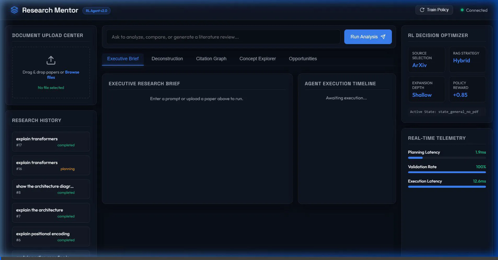
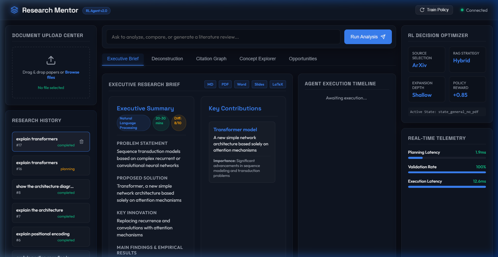
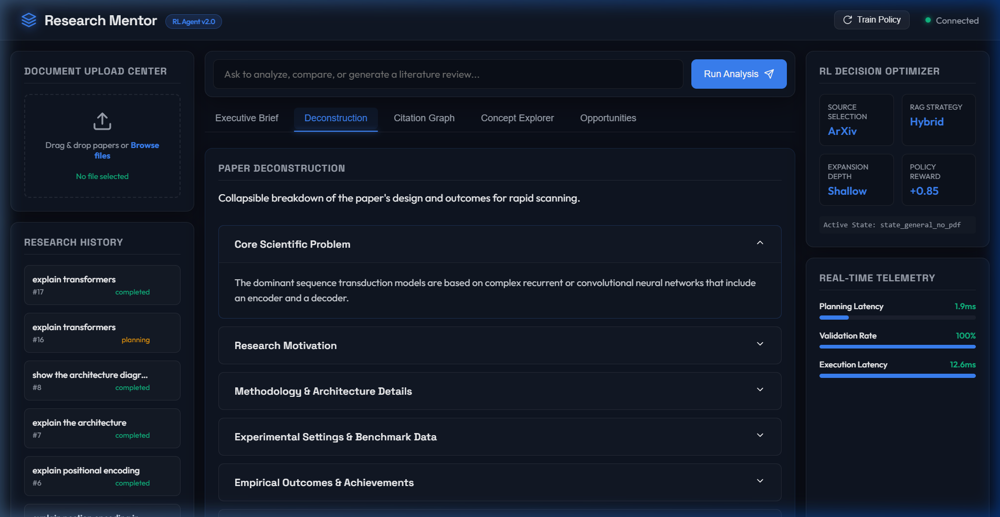
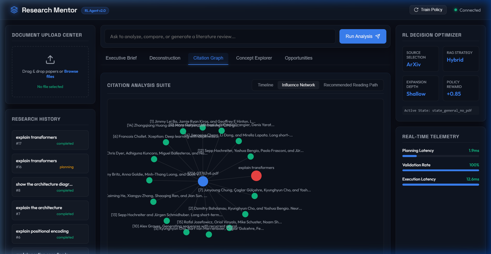
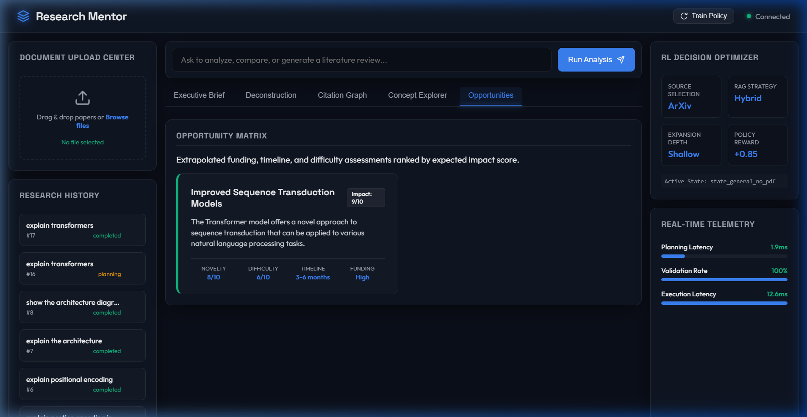
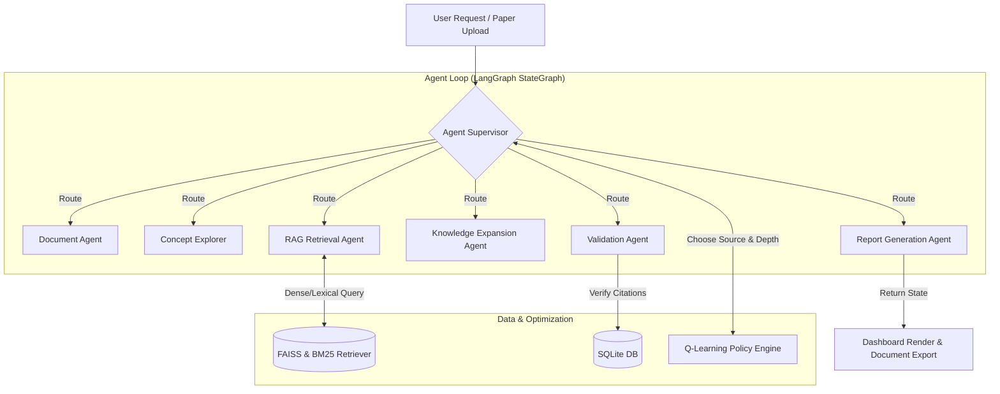

# Research Intelligence Platform

### *Transforming Scientific Literature into Interactive Knowledge*

An AI-powered research platform that helps users analyze, deconstruct, compare, and explore scientific papers through multi-agent orchestration, citation networks, and reinforcement learning optimization.

---

## 🎬 Project Demonstration

Below is an animated walkthrough of the Research Intelligence Platform showing dashboard navigation, interactive citation networks, technical concept explorer grids, and research opportunity matrices:



---

## 💡 Why This Project?

### The Problem
*   **Reading Friction:** Scientific papers are structured for traditional print rather than interactive consumption.
*   **Knowledge Fragmentation:** Research insights, experimental datasets, and citation structures remain isolated.
*   **Time-Intense Surveys:** Drafting literature reviews requires manually locating, reading, and synthesizing dozens of abstracts.
*   **Undetected Research Gaps:** Finding methodology limitations or missing evaluations is difficult and error-prone.
*   **Summarization Fallacy:** Standard AI assistants provide generic summaries that lose math, equations, and structure context.

### The Solution
The **Research Intelligence Platform** transforms research papers into interactive knowledge through AI-powered analysis, visualization, and reasoning. It leverages specialized agents to extract concepts, trace citation lineages, and map research opportunities.

---

## 🖥️ Visual Feature Walkthrough

### 1. Executive Research Brief Dashboard
The main dashboard displays an executive summary, problem statement, proposed solution, key innovations, and a reading roadmap for the active paper. It also lists real-time agent execution telemetry (such as planning, execution, and validation latencies).



### 2. Literature Review & Paper Deconstruction
Automatically compiles comparative reviews and methodology syntheses from retrieved context. The deconstruction interface breaks down the paper's core problem, motivation, experimental settings, and constraints into expandable, structured accordions.



### 3. Interactive Citation Influence Network
Generates node-link citation diagrams using D3.js. Nodes are sized dynamically based on their PageRank centrality to showcase their academic influence in the local citation network. A vertical chronological timeline tracks historic lineage.



### 4. Autonomous Research Gap Detection
Evaluates claims, constraints, and experimental settings against academic baselines. It flags missing evaluations, baseline flaws, or potential thesis directions, scoring each opportunity based on **Impact**, **Novelty**, and **Difficulty**.



---

## ⚙️ Dynamic System Architecture

The platform processes papers through a multi-tier agent loop. The state graph, citations, and execution telemetry are rendered dynamically on the dashboard.



### LangGraph Multi-Agent Orchestration Flow:
1.  **Document Analysis Node:** Parses structure and equations from multi-column PDFs using [pdf_tool.py](file:///c:/Users/shiva/OneDrive/Desktop/projects/Autonomous-Multi-Tool-Agent/backend/tools/pdf_tool.py).
2.  **Concept Extraction Node:** Isolates terms, definitions, and traces variable structures using [concept_explorer.py](file:///c:/Users/shiva/OneDrive/Desktop/projects/Autonomous-Multi-Tool-Agent/backend/agent/concept_explorer.py).
3.  **Research Retrieval Node:** Performs hybrid vector/keyword searches using [retrieve.py](file:///c:/Users/shiva/OneDrive/Desktop/projects/Autonomous-Multi-Tool-Agent/backend/rag/retrieve.py).
4.  **Knowledge Expansion Node:** Fetches external bibliographic contexts using [expansion_agent.py](file:///c:/Users/shiva/OneDrive/Desktop/projects/Autonomous-Multi-Tool-Agent/backend/agent/expansion_agent.py).
5.  **Validation Node:** Verifies factual claims and checks citations for hallucinations using [validator.py](file:///c:/Users/shiva/OneDrive/Desktop/projects/Autonomous-Multi-Tool-Agent/backend/agent/validator.py).
6.  **Report Generation Node:** Compiles final latex, docx, and pptx presentations using [export_tool.py](file:///c:/Users/shiva/OneDrive/Desktop/projects/Autonomous-Multi-Tool-Agent/backend/tools/export_tool.py).

---

## 🛠️ Technology Stack

| Layer | Technologies | Description |
| :--- | :--- | :--- |
| **Frontend UI** | Vanilla JS, HTML5, CSS3, Vite | SPA Dashboard with D3.js and WebSockets client. |
| **Backend API** | FastAPI, Python, WebSockets, Uvicorn | High-performance asynchronous endpoint router. |
| **Agent Core** | LangGraph, StateGraph Orchestrator | Coordinates state transitions and agent actions. |
| **Retrieval (RAG)** | FAISS, sentence-transformers, rank-bm25 | Hybrid semantic/lexical search with RRF reranking. |
| **Databases** | SQLite (default), PostgreSQL, Redis | Relational storage for tasks, telemetry, and Q-tables. |
| **RL Engine** | Custom Q-Learning Engine | Optimizes source selections and search depths. |

---

## 🚀 Quick Start Guide

### Containerized Execution (Recommended)
Launch the entire containerized application suite instantly using Docker Compose:

1.  **Ensure Docker Desktop is running** on your system.
2.  Clone the repository and navigate to the root directory:
    ```bash
    git clone https://github.com/yuyutsu01/ResearchMind.git
    cd ResearchMind
    ```
3.  Launch the services:
    ```bash
    docker-compose up --build
    ```
4.  Access the web dashboard in your browser at `http://localhost:3000`.

---

### Manual Local Setup (Alternative)

If you prefer to run the components locally outside of Docker:

#### 1. Setup Backend
1.  Navigate to the `backend` folder:
    ```bash
    cd backend
    ```
2.  Create and activate a virtual environment:
    ```bash
    python -m venv venv
    # Windows
    .\venv\Scripts\activate
    # macOS/Linux
    source venv/bin/activate
    ```
3.  Install dependencies:
    ```bash
    pip install -r requirements.txt
    ```
4.  Run the API server:
    ```bash
    python app.py
    ```

The API will be available at `http://localhost:8000`.

#### 2. Setup Frontend
1.  Navigate to the `frontend` folder:
    ```bash
    cd ../frontend
    ```
2.  Install dependencies:
    ```bash
    npm install
    ```
3.  Run the Vite development server:
    ```bash
    npm run dev
    ```

Open `http://localhost:5173` in your browser.

---

## 📊 Run Benchmarks & Telemetry

To evaluate agent performance metrics and generate mock data for the telemetry dashboard:

1.  Activate the backend virtual environment.
2.  Navigate to the `backend` directory:
    ```bash
    cd backend
    ```
3.  Run the benchmark suite:
    ```bash
This executes test prompts through the planner, executor, and validator nodes, verifying latency constraints and saving records in `research_platform.db`.

---

## 🔮 Future Work & Roadmap

### Addressing Sci-Bot Limitations
Sci-Hub recently launched an experimental AI assistant (**Sci-Bot**) to answer questions from its archives. However, early evaluations reveal significant limitations in its performance:
*   **Weak Multi-Turn Conversations:** Struggles to maintain deep context over multi-turn dialogues.
*   **Limited Access to Newer Papers:** Restricted to older literature with slow database updates.
*   **Weak Reference Relevance:** Citations provided are frequently not the most relevant to the query context.
*   **Low Research Assistance Capability:** Still far from replacing or effectively aiding a serious researcher.

We aim to directly resolve these gaps with the following roadmap items:
*   **Long-Context Orchestration:** Upgrade the LangGraph state loop to maintain deep conversational state and context history across long, multi-turn dialogues.
*   **Dynamic Literature Sync:** Connect real-time retrieval agents to ArXiv, PubMed, and Semantic Scholar to query and ingest newly published papers on-demand.
*   **PageRank Reranking Optimization:** Integrate PageRank centrality scoring directly into our hybrid RRF (Reciprocal Rank Fusion) reranker to prioritize the most academically influential references.
*   **Serious Researcher Co-Pilot:** Extend the validation agent with deeper mathematical and empirical fact-checking, making it a reliable partner for advanced academic research.

