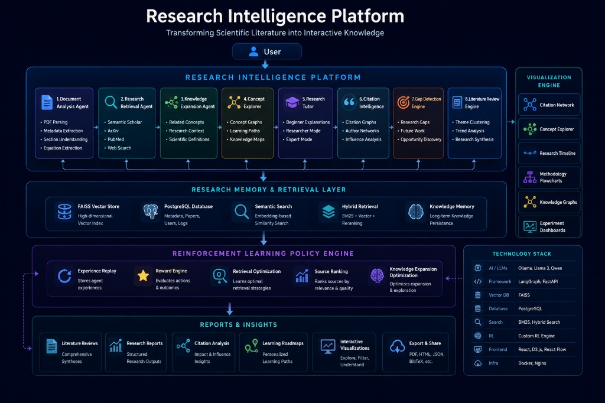

# Research Intelligence Platform

### *Transforming Scientific Literature into Interactive Knowledge*

An AI-powered research platform that helps users understand, analyze, visualize, compare, and explore scientific papers through multi-agent orchestration, citation networks, and reinforcement learning.

---

[](https://www.python.org/)
[](https://fastapi.tiangolo.com/)
[](https://github.com/langchain-ai/langgraph)
[](https://www.postgresql.org/)
[](https://github.com/facebookresearch/faiss)
[](https://en.wikipedia.org/wiki/Q-learning)

---

## 1. Why This Project?

### The Problem
*   **Reading Friction:** Scientific papers are structured for print rather than interactive consumption.
*   **Knowledge Fragmentation:** Research insights, experimental datasets, and citation structures remain isolated.
*   **Time-Intense Surveys:** Drafting literature reviews requires manually locating and reading dozens of abstracts.
*   **Undetected Research Gaps:** Finding methodology limitations or missing evaluations is difficult and error-prone.
*   **Summarization Fallacy:** Standard AI assistants provide generic summaries that lose math and structure context.

### The Solution
The **Research Intelligence Platform** transforms research papers into interactive knowledge through AI-powered analysis, visualization, and reasoning.

---

## 2. Key Features

*   **Research Analysis:** Extracts sections and isolates equations from multi-column PDFs using [pdf_tool.py](file:///c:/Users/shiva/OneDrive/Desktop/projects/Autonomous-Multi-Tool-Agent/backend/tools/pdf_tool.py).
*   **Literature Reviews:** Automatically compiles comparative reviews and methodology syntheses from retrieved context.
*   **Citation Intelligence:** Computes PageRank and maps bibliographic lineages using [citation_graph.py](file:///c:/Users/shiva/OneDrive/Desktop/projects/Autonomous-Multi-Tool-Agent/backend/tools/citation_graph.py).
*   **Concept Explorer:** Identifies core terms, definitions, and traces mathematical variable structures.
*   **Research Gap Detection:** Evaluates claims against baselines to flag experimental gaps using [gap_detector.py](file:///c:/Users/shiva/OneDrive/Desktop/projects/Autonomous-Multi-Tool-Agent/backend/agent/gap_detector.py).
*   **Research Tutor:** Adapts explanation complexity from Beginner analogies to Expert math derivations.
*   **Knowledge Graphs:** Automatically structures terminology hierarchies into graphical representations.
*   **Research Memory:** Indexes and correlates papers via a relational-vector system in [db.py](file:///c:/Users/shiva/OneDrive/Desktop/projects/Autonomous-Multi-Tool-Agent/backend/memory/postgres/db.py).
*   **Interactive Visualizations:** Renders live, responsive citation nets and timelines using [main.js](file:///c:/Users/shiva/OneDrive/Desktop/projects/Autonomous-Multi-Tool-Agent/frontend/src/main.js).
*   **Reinforcement Learning Optimization:** Dynamically updates retrieval sources and search depths in [policy_engine.py](file:///c:/Users/shiva/OneDrive/Desktop/projects/Autonomous-Multi-Tool-Agent/backend/agent/rl/policy_engine.py).
*   **Report Generation:** Exports generated findings, gap lists, and reviews into styled PDF documents.

---

## 3. Dynamic System Architecture

The platform processes papers through a multi-tier agent loop. For interactive documentation, the state graph and relationships are rendered dynamically in the dashboard rather than static layouts.

```text
User 
 └─► Research Intelligence Platform
      ├─► Ingestion (Document Analysis ──► Concept Explorer)
      ├─► Synthesis (Literature Review ──► Citation Intelligence ──► Gap Detector)
      └─► Interface (Adaptive Research Tutor ──► Visualization Engine)
           └─► Memory + Retrieval + RL Layer (FAISS + Postgres + Policy Engine)
                └─► Reports & Insights
```

> [!TIP]
> **Interactive Architecture Explorer:** In the live application, the architecture can be explored interactively using React Flow and D3.js. This includes features like **Zoom/Pan**, **Agent Execution Traces**, **Data Flow Visualization**, and **State Inspection**.
>
> 

---

## 4. Research Ingestion Workflow

The platform coordinates paper parsing and research generation in a sequence of automated stages:


---

## 5. Example Use Cases

*   **Analyze a Research Paper:** Extract sections, mathematical formulas, and terminology instantly.
*   **Generate Literature Reviews:** Synthesize multi-paper themes and historical research progress.
*   **Compare Multiple Papers:** Contrast dataset limits, algorithms, and empirical experiments.
*   **Discover Research Gaps:** Uncover missing evaluations, baseline flaws, or potential thesis directions.
*   **Build Citation Networks:** Chart PageRank influence and lineages across multiple papers.
*   **Create Learning Roadmaps:** Adapt explanation vocabulary from Beginner analogies to Expert equations.

---

## 6. Technology Stack

| Layer | Technologies |
| :--- | :--- |
| **Frontend UI** | Vanilla JS, HTML5, CSS3, Vite |
| **Backend API** | FastAPI, Python, WebSockets, Uvicorn |
| **Agent Core** | LangGraph, StateGraph Orchestrator |
| **Retrieval (RAG)** | FAISS, sentence-transformers, rank-bm25 |
| **Databases** | PostgreSQL, Redis, SQLite Fallback |
| **RL Engine** | Custom Q-Learning Engine |
| **Processing** | PyMuPDF (fitz), pdfplumber, reportlab |
| **Infrastructure** | Docker, Docker Compose |

---

## 7. Project Directory Structure

```text
Autonomous-Multi-Tool-Agent/
├── backend/
│   ├── agent/       # Multi-agent LangGraph coordinator (supervisor.py)
│   │   └── rl/      # Reinforcement Learning policy engine (policy_engine.py)
│   ├── memory/      # Relational Postgres & cache adapters (db.py)
│   ├── rag/         # Hybrid keyword-semantic retriever (retrieve.py)
│   └── tools/       # Parsing, citation mapping, and export APIs (pdf_tool.py)
├── frontend/        # Single Page Application frontend (main.js)
└── docs/            # Local manual configuration guides (setup.md)
```

---

## 8. Quick Start

Start the entire containerized suite instantly with Docker Compose:

```bash
# Clone the repository
git clone https://github.com/shivanandvp/Autonomous-Multi-Tool-Agent.git

# Launch services
docker-compose up --build
```

Access the UI dashboard at `http://localhost:3000`.

*For local manual setup instructions and environment variable parameters, refer to [setup.md](file:///c:/Users/shiva/OneDrive/Desktop/projects/Autonomous-Multi-Tool-Agent/docs/setup.md).*

---

## 9. Roadmap

- [ ] **Autonomous Research Agents:** Automated note collection and literature drafting.
- [ ] **Knowledge Graph Expansion:** Real-time linkage of terminology nodes with Wikidata.
- [ ] **Collaborative Research Workspaces:** Group citation sharing and shared document annotations.
- [ ] **Multi-Language Research Support:** Parsing and translation of non-English scientific publications.
- [ ] **Advanced RL Policies:** Proximal Policy Optimization (PPO) integration for retrieval.
- [ ] **Research Recommendation Engine:** Adaptive paper suggestions based on user research history.

---

## 10. License

Distributed under the MIT License. See [LICENSE](file:///c:/Users/shiva/OneDrive/Desktop/projects/Autonomous-Multi-Tool-Agent/LICENSE) for details.

---

Contributions are welcome via pull requests.
