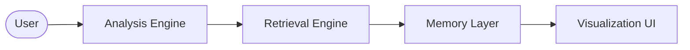

# Research Intelligence Platform

### *Transforming Scientific Literature into Interactive Knowledge*

A universal AI-powered research platform that helps users understand, analyze, visualize, compare, and explore scientific papers through multi-agent AI, advanced retrieval systems, citation intelligence, reinforcement learning, and interactive research mentoring.

---

[](https://www.python.org/)
[](https://fastapi.tiangolo.com/)
[](https://github.com/langchain-ai/langgraph)
[](https://www.postgresql.org/)
[](https://github.com/facebookresearch/faiss)
[](https://en.wikipedia.org/wiki/Q-learning)

---

## 🔗 Quick Links
- 🚀 **[Live Demo](https://demo.research-intelligence.platform)** *(Placeholder)* | 📖 **[Documentation](https://docs.research-intelligence.platform)** *(Placeholder)* | 📄 **[License](file:///c:/Users/shiva/OneDrive/Desktop/projects/Autonomous-Multi-Tool-Agent/LICENSE)**

---

## 2. Problem Statement

Academic papers are static, dense, and disconnected. Traditional RAG systems merely summarize text, losing structural context, mathematical variable relations, and historical scientific citation lineages.

The **Research Intelligence Platform** solves this by converting static PDF literature into dynamic, interactive, and connected knowledge bases.

---

## 3. Key Features

- **Structural Deep Analysis:** Parses multi-column PDFs and extracts clean logical sections and mathematical formulas using [pdf_tool.py](file:///c:/Users/shiva/OneDrive/Desktop/projects/Autonomous-Multi-Tool-Agent/backend/tools/pdf_tool.py).
- **Adaptive Research Tutoring:** Explains complex concepts by dynamically adjusting explanation style between Beginner, Intermediate, Researcher, and Expert levels.
- **Citation Intelligence:** Computes PageRank and influence weights over bibliography graphs to discover foundational papers using [citation_graph.py](file:///c:/Users/shiva/OneDrive/Desktop/projects/Autonomous-Multi-Tool-Agent/backend/tools/citation_graph.py).
- **Research Gap Detection:** Automatically identifies omissions, untested methodology boundaries, and potential future research directions via [gap_detector.py](file:///c:/Users/shiva/OneDrive/Desktop/projects/Autonomous-Multi-Tool-Agent/backend/agent/gap_detector.py).
- **Interactive Visualizations:** Translates bibliography relationships and concept links into interactive visual graphs using [main.js](file:///c:/Users/shiva/OneDrive/Desktop/projects/Autonomous-Multi-Tool-Agent/frontend/src/main.js).

---

## 4. High-Level Architecture

The platform uses a LangGraph-orchestrated [supervisor.py](file:///c:/Users/shiva/OneDrive/Desktop/projects/Autonomous-Multi-Tool-Agent/backend/agent/supervisor.py) state machine, utilizing Reinforcement Learning in [policy_engine.py](file:///c:/Users/shiva/OneDrive/Desktop/projects/Autonomous-Multi-Tool-Agent/backend/agent/rl/policy_engine.py) to dynamically tune the RAG search depth.



*   **Analysis Engine:** Processes the document layout structure.
*   **Retrieval Engine:** Queries vector stores and academic APIs dynamically.
*   **Memory Layer:** PostgreSQL and FAISS hybrid vector store managed in [db.py](file:///c:/Users/shiva/OneDrive/Desktop/projects/Autonomous-Multi-Tool-Agent/backend/memory/postgres/db.py).
*   **Visualization UI:** Live websocket updates and interactive graphs.

---

## 5. Screenshots

| Research Dashboard | Concept Explorer |
| :---: | :---: |
|  |  |
| **Citation Network** | **Research Tutor Mode** |
|  |  |

---

## 6. Technology Stack

- **Frontend:** Vanilla JS, HTML5, CSS3, Vite
- **Backend:** FastAPI, Python, WebSockets, Uvicorn
- **Orchestration:** LangGraph, StateGraph
- **Retrieval & DB:** FAISS, sentence-transformers, rank-bm25, PostgreSQL, Redis, SQLite
- **Document Processing:** PyMuPDF (fitz), pdfplumber, reportlab

---

## 7. Quick Start

### Run with Docker (Recommended)
```bash
docker-compose up --build
```
Access the application at `http://localhost:3000`.

### Local Manual Installation
1. **Backend:**
   ```bash
   cd backend
   python -m venv venv
   source venv/bin/activate # Windows: venv\Scripts\activate
   pip install -r requirements.txt
   uvicorn app:app --reload
   ```
2. **Frontend:**
   ```bash
   cd frontend
   npm install
   npm run dev
   ```

*Requires setting `OPENAI_API_KEY` in `backend/.env`.*

---

## 8. Roadmap

- [ ] **Autonomous Research Agents:** Automated note collection and literature drafting.
- [ ] **Knowledge Graph Expansion:** Real-time linkage of terminology nodes with Wikidata.
- [ ] **Multi-Language Support:** Translation and analysis of non-English research papers.
- [ ] **Graph Neural Networks:** Advanced paper recommendations based on citation graph structures.

---

## 9. License

Distributed under the MIT License. See [LICENSE](file:///c:/Users/shiva/OneDrive/Desktop/projects/Autonomous-Multi-Tool-Agent/LICENSE) for more information.

---

Contributions are welcome via pull requests.
