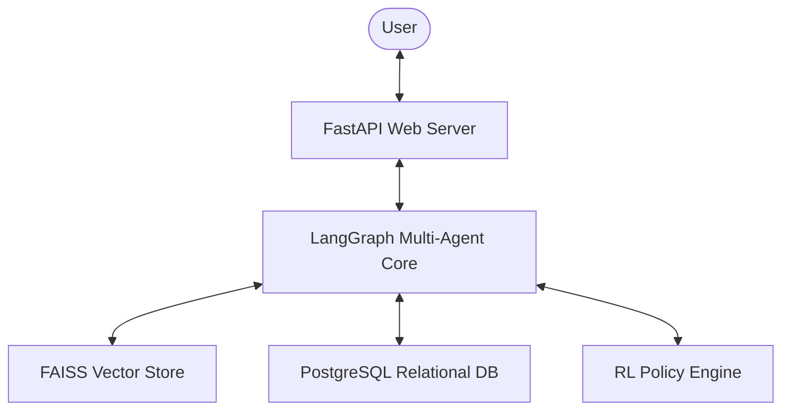

# Research Intelligence Platform

### *Transforming Scientific Literature into Interactive Knowledge*

A universal AI-powered research platform that helps users understand, analyze, visualize, compare, and explore scientific papers through multi-agent AI, advanced retrieval systems, citation intelligence, reinforcement learning, and interactive research mentoring.

---

[](https://www.python.org/)
[](https://fastapi.tiangolo.com/)
[](https://github.com/langchain-ai/langgraph)
[](https://www.postgresql.org/)
[](https://github.com/facebookresearch/faiss)
[](https://en.wikipedia.org/wiki/Q-learning)

---

## 1. Problem Statement

Academic papers are static, dense, and disconnected. Traditional RAG systems merely summarize text, losing structural context, mathematical variable relations, and historical scientific citation lineages.

The **Research Intelligence Platform** solves this by converting static PDF literature into dynamic, interactive, and connected knowledge bases.

---

## 2. Key Features

- **Structural Deep Analysis:** Parses multi-column PDFs and extracts clean logical sections and mathematical formulas using [pdf_tool.py](file:///c:/Users/shiva/OneDrive/Desktop/projects/Autonomous-Multi-Tool-Agent/backend/tools/pdf_tool.py).
- **Adaptive Research Tutoring:** Explains complex concepts by dynamically adjusting explanation style between Beginner, Intermediate, Researcher, and Expert levels.
- **Citation Intelligence:** Computes PageRank and influence weights over bibliography graphs to discover foundational papers using [citation_graph.py](file:///c:/Users/shiva/OneDrive/Desktop/projects/Autonomous-Multi-Tool-Agent/backend/tools/citation_graph.py).
- **Research Gap Detection:** Automatically identifies omissions, untested methodology boundaries, and potential future research directions via [gap_detector.py](file:///c:/Users/shiva/OneDrive/Desktop/projects/Autonomous-Multi-Tool-Agent/backend/agent/gap_detector.py).
- **Interactive Visualizations:** Translates bibliography relationships and concept links into interactive visual graphs using [main.js](file:///c:/Users/shiva/OneDrive/Desktop/projects/Autonomous-Multi-Tool-Agent/frontend/src/main.js).

---

## 3. System Architecture

The platform uses a LangGraph-orchestrated multi-agent StateGraph. A reinforcement learning engine dynamically optimizes search query source and depth parameters based on output validation feedback.



*   **FastAPI Web Server:** Manages WebSocket connections for real-time telemetry streaming.
*   **LangGraph Multi-Agent Core:** Manages transitions between Document Ingestion, Terminology Extraction, Retrieval, and Validation nodes.
*   **Hybrid Memory:** Integrates FAISS semantic vector search with PostgreSQL relational schema managed via [db.py](file:///c:/Users/shiva/OneDrive/Desktop/projects/Autonomous-Multi-Tool-Agent/backend/memory/postgres/db.py).
*   **RL Policy Engine:** Custom Q-Learning implementation in [policy_engine.py](file:///c:/Users/shiva/OneDrive/Desktop/projects/Autonomous-Multi-Tool-Agent/backend/agent/rl/policy_engine.py) that learns optimal retrieval actions to maximize validation scores.

### Agent Core Structure

| Agent | Source File | Core Responsibility |
| :--- | :--- | :--- |
| **Supervisor** | [supervisor.py](file:///c:/Users/shiva/OneDrive/Desktop/projects/Autonomous-Multi-Tool-Agent/backend/agent/supervisor.py) | Manages graph state, routing, and reinforcement learning decisions. |
| **Document Parser** | [document_agent.py](file:///c:/Users/shiva/OneDrive/Desktop/projects/Autonomous-Multi-Tool-Agent/backend/agent/document_agent.py) | Performs high-fidelity layout segmentation and PDF ingestion. |
| **Concept Explorer** | [concept_explorer.py](file:///c:/Users/shiva/OneDrive/Desktop/projects/Autonomous-Multi-Tool-Agent/backend/agent/concept_explorer.py) | Extracts terminology and resolves mathematical formula relations. |
| **Retrieval Engine** | [retrieval_agent.py](file:///c:/Users/shiva/OneDrive/Desktop/projects/Autonomous-Multi-Tool-Agent/backend/agent/retrieval_agent.py) | Executes hybrid vector searches and API crawling. |
| **Knowledge Expansion** | [expansion_agent.py](file:///c:/Users/shiva/OneDrive/Desktop/projects/Autonomous-Multi-Tool-Agent/backend/agent/expansion_agent.py) | Recursively maps bibliography citation networks. |
| **Gap Detector** | [gap_detector.py](file:///c:/Users/shiva/OneDrive/Desktop/projects/Autonomous-Multi-Tool-Agent/backend/agent/gap_detector.py) | Analyzes empirical data to find methodological omissions. |
| **Factual Validator** | [validator.py](file:///c:/Users/shiva/OneDrive/Desktop/projects/Autonomous-Multi-Tool-Agent/backend/agent/validator.py) | Audits generated outputs and manages retry loops. |
| **Report Generator** | [report_agent.py](file:///c:/Users/shiva/OneDrive/Desktop/projects/Autonomous-Multi-Tool-Agent/backend/agent/report_agent.py) | Compiles research reviews and logs into final PDF files. |

---

## 4. Technology Stack

- **Frontend:** Vanilla JS, HTML5, CSS3, Vite
- **Backend:** FastAPI, Python, WebSockets, Uvicorn
- **Orchestration:** LangGraph, StateGraph
- **Retrieval & DB:** FAISS, sentence-transformers, rank-bm25, PostgreSQL, Redis, SQLite
- **Document Processing:** PyMuPDF (fitz), pdfplumber, reportlab

---

## 5. Quick Start

### Run with Docker (Recommended)
```bash
docker-compose up --build
```
Access the application at `http://localhost:3000`.

### Local Manual Installation
1. **Backend:**
   ```bash
   cd backend
   python -m venv venv
   source venv/bin/activate # Windows: venv\Scripts\activate
   pip install -r requirements.txt
   uvicorn app:app --reload
   ```
2. **Frontend:**
   ```bash
   cd frontend
   npm install
   npm run dev
   ```

*Requires setting `OPENAI_API_KEY` in `backend/.env`.*

---

## 6. Roadmap

- [ ] **Autonomous Research Agents:** Automated note collection and literature drafting.
- [ ] **Knowledge Graph Expansion:** Real-time linkage of terminology nodes with Wikidata.
- [ ] **Multi-Language Support:** Translation and analysis of non-English research papers.
- [ ] **Graph Neural Networks:** Advanced paper recommendations based on citation graph structures.

---

## 7. License

Distributed under the MIT License. See [LICENSE](file:///c:/Users/shiva/OneDrive/Desktop/projects/Autonomous-Multi-Tool-Agent/LICENSE) for more information.

---

Contributions are welcome via pull requests.
