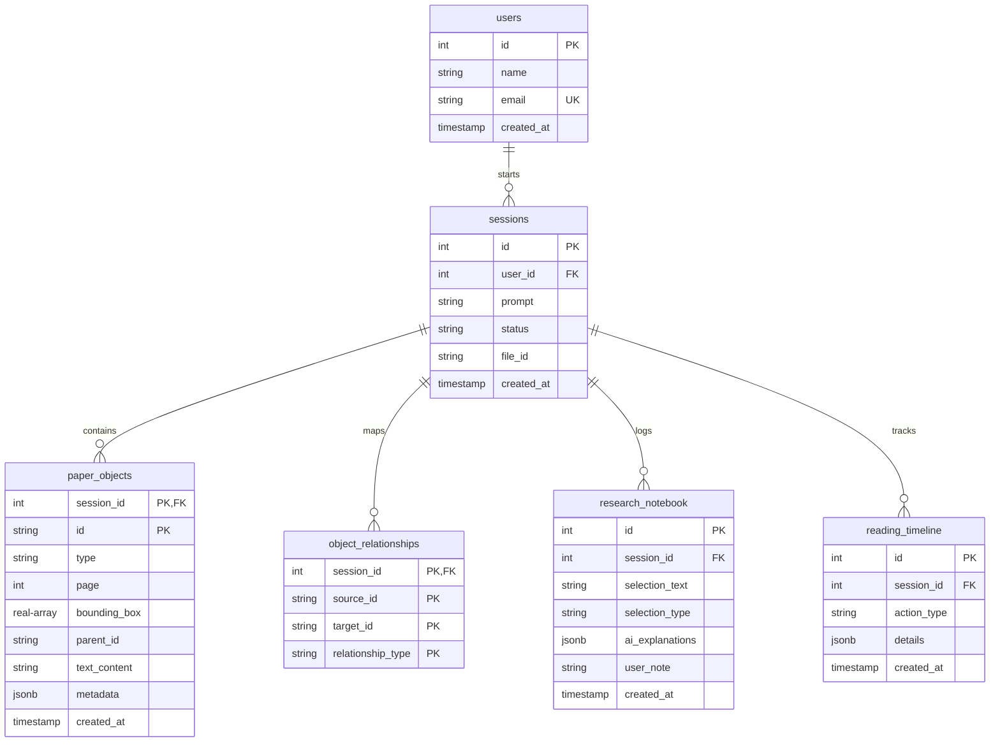

# ResearchMind - Interactive AI Scholar Workspace: Complete Technical & Architectural Analysis

This document provides a comprehensive, production-grade reverse engineering and architectural analysis of the **ResearchMind** workspace codebase. It is designed to serve as a definitive onboarding guide and technical reference for newly joined engineers, staff architects, and automated AI agents.

---

## 1. Executive Summary

**ResearchMind** is an interactive, AI-powered scholar workspace designed to keep research papers at the center of the reading experience. By rendering PDFs directly inside the browser and layer-mapping layout elements (paragraphs, equations, figures, tables, bibliography), it turns the passive reading experience into an interactive canvas. 

When a user highlights text or selects a layout element, a collaborating swarm of specialized AI agents analyzes the context in parallel, providing multi-perspective annotations (intuition, mathematical derivation, prerequisite background, structural diagrams, etc.).

### System Status Summary
* **Repository Maturity**: Functional MVP with clean modular architecture, local embedding engine, and parallel LLM orchestration.
* **Core Strengths**: Low-latency design, progressive page ingestion pipeline (outline loaded in <500ms, pages indexed in background), parallelized multi-agent execution, and L1 Redis caching.
* **Critical Risks/Weaknesses**: 
  1. **Docker Setup Broken**: `docker-compose.yml` references `Dockerfile` files in `backend` and `frontend`, but **no Dockerfiles exist in the repository**.
  2. **Environment Variable Configuration Mismatch**: The backend code is hardcoded to look for `OPENAI_API_KEY` and calls `https://api.openai.com/v1/chat/completions`. However, `.env` and `docker-compose.yml` define `LLM_API_KEY`, `LLM_BASE_URL` (pointing to Groq), and `LLM_MODEL`. Thus, the settings in `.env` are ignored, forcing the backend to use the offline mock responder.
  3. **No Migration Framework**: Schema initialization is managed using raw `CREATE TABLE IF NOT EXISTS` statements inside python code, complicating schema evolution.
  4. **Unused Dependencies**: `zustand` is installed in the frontend but not utilized; all state is managed locally via React hooks.

---

## 2. Project Purpose & Problem Statement

### The Problem
Academic research is highly non-linear and context-heavy. A researcher reading a complex paper must constantly switch contexts to look up:
* Mathematical formulations (how a derivation was reached)
* Prerequisite concepts (terms, frameworks)
* Visualizations (flowcharts of model pipelines)
* Citations (what prior papers introduced a specific concept)

This constant context-switching increases cognitive load and slows down comprehension.

### The Solution
**ResearchMind** eliminates context-switching by overlaying a semantic interaction layer directly on top of the PDF. When elements are highlighted or clicked, specialized background agents collaborate via an orchestrator to populate a side-panel in real-time, matching the reader's cognitive needs:
* **Novice to Expert levels**: Multi-tiered explanations.
* **Math breakdown**: LaTeX extraction and step-by-step variable mapping.
* **Conceptual mapping**: Dynamic ASCII flowcharts of architectures.

---

## 3. Business Domain & User Personas

```
┌────────────────────────────────────────────────────────┐
│                   RESEARCHMIND WORKSPACE               │
├───────────────────────────────┬────────────────────────┤
│                               │   SWARM ANALYST PANEL  │
│      PDF Rendering Canvas     │ ┌────────────────────┐ │
│  (Direct Interaction Overlay) │ │ Level: Beginner    │ │
│                               │ │ [Math] [Visual]    │ │
│  "F(s,a,s') = γΦ(s') - Φ(s)"  │ ├────────────────────┤ │
│  [Border highlight: EQUATION] │ │   Simple Intuition │ │
│                               │ │   Variable Definitions││
│                               │ └────────────────────┘ │
└───────────────────────────────┴────────────────────────┘
```

### Business Domain
* Academic Technology (EdTech) / AI Scholar Tooling.
* Information Extraction and Knowledge Representation.

### User Personas
1. **Academic Researchers & PhDs**: Need to quickly trace citations, verify metrics, and understand equations in the context of methodology.
2. **Graduate/Undergraduate Students**: Need prerequisite concepts broken down, terms defined, and simple intuitions for advanced topics.
3. **Engineering Practitioners**: Need to read papers to implement architectures (relying heavily on the ASCII block diagrams and derivations).

---

## 4. Complete Technology Stack

| Component | Technology | Version (from repo) | Role & Integration | Alternatives |
| :--- | :--- | :--- | :--- | :--- |
| **Frontend Framework** | **Next.js** | `16.2.11` (React `19.2.4`) | High-performance client-side rendering with Next App Router. | Vite + React, Nuxt.js |
| **Styling** | **Tailwind CSS** | `^4` (with PostCSS) | Modern utility styling loaded via `@import "tailwindcss"` in `globals.css`. | CSS Modules, SASS |
| **Icons** | **Lucide React** | `^1.25.0` | SVG iconography for navigation and toolbar widgets. | FontAwesome, Heroicons |
| **PDF Rendering** | **PDF.js** | `3.4.120` (CDN) | Client-side page rendering and layout bounding box overlay. | react-pdf |
| **API Framework** | **FastAPI** | `>=0.110.0` | Gateway serving REST and WebSockets. | Express (Node.js), Go |
| **PDF Parsing** | **PyMuPDF (fitz)** | `>=1.23.26` | Backend document ingestion, layout block mapping, and coordinate parser. | PDFPlumber, PyPDF |
| **Database** | **PostgreSQL** | `15` (Alpine Docker) | Persistent store for parsed layout elements, sessions, and notebooks. | MySQL, SQLite |
| **Vector DB** | **Qdrant** | `Latest` (Docker) | Semantic vector memory for text block retrieval page-by-page. | Pinecone, Milvus |
| **Embeddings Engine**| **SentenceTransformers** | `>=2.5.1` | Local inference generating 384-dim embeddings (`all-MiniLM-L6-v2`). | OpenAI Embeddings |
| **Caching Engine** | **Redis** | `7` (Alpine Docker) | Hot explanation caching with TTL keys (defaults to 3600s). | Memcached |
| **Task Queue** | **asyncio.Queue** | Standard Library | Managed in-memory queues for prioritized page embedding generation. | Celery, RabbitMQ |
| **HTTP Client** | **httpx** | `>=0.27.0` | Non-blocking LLM adapter requests. | requests, aiohttp |
| **LLM Integration** | **OpenAI API / Groq** | Custom client | LLM gateway for structural analysis (JSON format). | LangChain OpenAI |

---

## 5. Architectural Topology

ResearchMind is designed as a **Modular Monolith** that separates logic into domain-driven layers while keeping deployments unified.

```
                           ┌───────────────────────────┐
                           │      Next.js Frontend     │
                           │  (PDF Canvas + Side Panel)│
                           └─────────────┬─────────────┘
                                         │ REST / WebSockets
                                         ▼
                           ┌───────────────────────────┐
                           │      FastAPI Gateway      │
                           └──────┬─────────────┬──────┘
                                  │             │
        ┌─────────────────────────┘             └─────────────────────────┐
        ▼ Ingestion Queue                                                 ▼ Selection API
┌──────────────────────────────┐                                ┌─────────────────────────┐
│     Background Worker        │                                │    Swarm Orchestrator   │
│  (Progressive Parser Fitz)   │                                │  (orchestrator.py)      │
└──────┬──────────────┬────────┘                                └─────────┬───────────────┘
       │              │                                                   │
       ▼ Relational   ▼ Vectors                                 ┌─────────┼───────────┐
┌────────────┐  ┌────────────┐                                  ▼         ▼           ▼
│ PostgreSQL │  │   Qdrant   │                               [Math]    [Visual]    [Explain]
│ (Metadata) │  │(Embeddings)│                               Agent     Agent       Agent
└────────────┘  └────────────┘                                  │         │           │
                                                                └─────────┼───────────┘
                                                                          │ (L1 Cache check)
                                                                          ▼
                                                                     ┌─────────┐
                                                                     │  Redis  │
                                                                     └────────┘
```

### Architectural Decisions & Rationale
1. **Stigmergy & Coordination (Bio-Inspired)**:
   Instead of using rigid DAG orchestrators (e.g., LangGraph chains) that break if one API fails, ResearchMind relies on a blackboard-like schema. The state is recorded inside PostgreSQL, and agents run in parallel to resolve sections.
2. **Selective Parallel Execution**:
   To minimize latency, the Orchestrator does not activate all agents. It parses the selection type (e.g. `EQUATION`, `FIGURE`) and parallelizes only the relevant agents using `asyncio.gather(*tasks.values())`.
3. **On-Demand Vector Priority Queue**:
   To make documents readable in < 1.5s, the progressive background worker parses layout outlines first (Pass 1) and writes to Postgres. Embeddings are generated in the background page-by-page. If a user scrolls to page 5, the frontend fires a `page_visible` websocket event, prompting the worker to bump page 5 to the top of the queue (Pass 2).

---

## 6. Directory Analysis

```
ResearchMind/
├── .agents/                 # Workspace-level customizations and instructions
│   └── AGENTS.md            # Empty constraints file for AI agents
├── .github/                 # CI/CD Workflows
│   └── workflows/
│       └── ci.yml           # Runs syntax linting and mock benchmarks
├── backend/                 # Python backend
│   ├── reports/             # Placeholder directory for generated reports
│   ├── src/                 # Main source directory
│   │   ├── adapters/        # Interface controllers
│   │   │   ├── api/         # REST API routes and Websockets
│   │   │   ├── db/          # Relational, Vector, and Caching database connectors
│   │   │   └── llm_adapter.py # LLM client wrapping OpenAI / Groq calls
│   │   ├── domain/          # Core domain models and business logic
│   │   │   ├── parser/      # Fitz/PyMuPDF coordinate layouts mapping
│   │   │   ├── services/    # Async background task loops and viewport priority queues
│   │   │   └── swarm/       # Collaborating agents definition and routing orchestrator
│   │   └── main.py          # Application bootstrapper and lifecycle manager
│   ├── tests/               # Pytest tests suite
│   │   └── test_swarm.py    # Mock database and Swarm orchestrator test
│   ├── benchmark.py         # Latency measurement benchmark CLI
│   ├── requirements.txt     # Python dependency list
│   └── uploads/             # Stores uploaded PDFs
├── deploy/                  # Orchestration configurations
│   └── docker-compose.yml   # Multi-container local orchestration (Postgres, Redis, Qdrant)
└── frontend/                # Next.js 16 (React 19) client application
    ├── public/              # Static files
    ├── src/                 # Client source files
    │   ├── app/             # Page layouts, globals, and navigation views
    │   └── components/      # Canvas-rendered PDF overlays and scroll managers
    ├── package.json         # Node.js dependencies
    └── tsconfig.json        # TypeScript compile rules
```

---

## 7. Deep Source Code Walkthrough

### 1. Ingestion Pipeline (`pdf_parser.py` & `background_worker.py`)
The parser is rule-based and works in multiple passes:
* **Capability Detection**: Analyzes character count vs. pages to categorize the PDF structure.
* **Layout Parsing**: Extracts text blocks via PyMuPDF's `page.get_text("blocks")` and identifies headings using regex matches for common section titles (`abstract`, `introduction`, etc.).
* **Equation Extraction**: Parses line spans using regex keywords and math characters (e.g. `\theta`, `\pi`, `^`, `_`, `=`, `\`).
* **Figure Extraction**: Queries `page.get_images()` and maps drawing bounding boxes.

### 2. Multi-Agent Swarm (`agents.py` & `orchestrator.py`)
Each agent subclasses `BaseAgent` and implements a specific domain query:
* **`MathematicsAgent`**: Uses a prompt designed to structure math formulas into cleaner LaTeX, mapping variable definitions and steps.
* **`VisualTeachingAgent`**: Instructs the LLM to output a structured ASCII block diagram representing the concepts.
* **`SwarmOrchestrator`**:
  ```python
  async def process_selection(self, session_id: int, selection_text: str, selection_type: str, obj_id: str = None):
      # ... Selective Activation ...
      if s_type == "equation":
          tasks["math"] = asyncio.to_thread(math_agent.analyze_equation, ...)
          tasks["background"] = asyncio.to_thread(background_agent.get_prerequisites, ...)
      # Runs tasks in parallel
      results = await asyncio.gather(*tasks.values(), return_exceptions=True)
  ```
  It wraps synchronous requests using `asyncio.to_thread` to prevent thread-blocking issues in FastAPI's async event loop.

### 3. Client State & Virtualization (`ReadingWorkspace.tsx` & `page.tsx`)
The frontend is built with performance in mind:
* **Double Layer Canvas**: Standard text layout elements are rendered on a transparent overlay (`select-text`) aligned perfectly with the underlying PDF canvas render (`z-0 pointer-events-none`).
* **Viewport Virtualization**: Uses an `IntersectionObserver` to monitor visible pages:
  ```typescript
  const isPageVisible = !!(visiblePages[pageNum] || visiblePages[pageNum - 1] || visiblePages[pageNum + 1]);
  ```
  If a page is not visible, it is unmounted and replaced with a lightweight skeleton container, freeing up browser canvas memory.

---

## 8. End-to-End Data Flow

```
[User Highlights Equation] 
       │ (MouseUp triggers selection menu)
       ▼
[Next.js Client Workspace] 
       │ (Sends ws message: type="selection", text="F(s,a,s') = ...", selection_type="EQUATION")
       ▼
[FastAPI WebSocket Router] 
       │ (Extracts message payloads and invokes SwarmOrchestrator)
       ▼
[Swarm Orchestrator (orchestrator.py)]
       │ (Decides route: activates Math, Background, Visual, and Questions agents)
       ├─► [MathAgent] ──────► (Checks Redis cache: cache:agent:MathematicsAgent:...) 
       │                                     │
       │                                     ├─► [Cache Hit]  ──► Return json
       │                                     └─► [Cache Miss] ──► Call LLM (OpenAI API) ──► Cache in Redis
       ├─► [VisualAgent] ────► (Run parallel calls in threads)
       └─► [BackgroundAgent] ─► (Run parallel calls in threads)
       │ 
       ▼ (Merge results into dictionary)
[Save Timeline Trace] ───────► (Inserts metadata trace into reading_timeline in Postgres)
       │
       ▼ (Send message back to client: type="selection_explanation")
[Next.js UI Panel] ──────────► (Unfreezes sidebar loader, populates tabs with ASCII charts and LaTeX equations)
```

---

## 9. API Specifications

### REST Endpoints
* **`POST /api/v1/upload`**:
  * **Description**: Saves uploaded PDF file to disk.
  * **Payload**: `Multipart/Form-Data` containing file.
  * **Response**: `{"file_id": string, "filename": string, "status": "uploaded", "success": true}`.
* **`POST /api/v1/sessions`**:
  * **Description**: Creates a new session record and triggers the background ingestion task.
  * **Payload**: `{"user_id": int, "prompt": string, "file_id": string}`.
  * **Response**: `{"session_id": int, "status": "LOADING_PDF", "prompt": string}`.
* **`GET /api/v1/sessions/{session_id}/paper`**:
  * **Description**: Returns paper metadata and reconstructs textual sections from postgres layout elements.
* **`GET /api/v1/sessions/{session_id}/objects`**:
  * **Description**: Fetches all layout blocks (page, bounding boxes, text content, type) extracted for the session.
* **`GET /api/v1/sessions/{session_id}/objects/{obj_id}`**:
  * **Description**: Details of a layout object and its cross-links (e.g. equation references).
* **`GET /api/v1/sessions/{session_id}/notebook`**:
  * **Description**: Fetches saved researcher highlights and annotations.
* **`POST /api/v1/sessions/{session_id}/notebook`**:
  * **Description**: Adds an annotation block into the Postgres research database.
* **`GET /api/v1/sessions/{session_id}/timeline`**:
  * **Description**: Retrieves history timeline logs.

### WebSocket Gateway
* **`WS /ws/v1/research/{session_id}`**:
  * **Client messages**:
    * `{"type": "page_visible", "page": int}`: Informs the parser queue to prioritize vector indexing for this page.
    * `{"type": "selection", "text": string, "selection_type": string, "id": string}`: Triggers swarm analysis for the selection block.
  * **Server messages**:
    * `{"type": "state_change", "state": "CONNECTED"}`
    * `{"type": "progress_update", "step": "SECTIONS_READY"|"PAGE_PARSED"|"COMPLETE"|"ERROR", "msg": string}`
    * `{"type": "selection_explanation", "explanation": json, "text": string}`

---

## 10. Database Schema

All schemas are dynamically initialized at startup:



---

## 11. Security Audit

* **Secrets Management**: Credentials (e.g. database URLs, Groq API keys) are stored in plain text inside `.env`.
* **CORS Middleware Policy**: Configured to allow all origins (`allow_origins=["*"]`). While acceptable for local sandboxes, this must be restricted to specific domains before staging/production deployments.
* **SQL Injection Risk**: The adapter uses parameterized queries (`execute_query(query, params)`), preventing basic SQL injection. However, database transactions are opened manually without an ORM (like SQLAlchemy), increasing the risk of syntax mistakes or unescaped values if raw formatting is used.
* **LLM Input Sanitization (Prompt Injection)**: Highlighted text is directly interpolated into prompts (`user_prompt = f"Highlight: \"{text}\""`). A malicious research paper could include prompt injection instructions. Input sanitization or system instruction reinforcement is needed.

---

## 12. Performance & Caching Review

* **L1 Redis Cache**: Sub-50ms retrieval speed for identical selection overlays.
* **L2 Vector Database (Qdrant)**: Limits vectors to `session_id`, minimizing retrieval scan times.
* **Local Embeddings Latency**: SentenceTransformers runs locally. This saves API costs but might introduce CPU/GPU bottlenecks on weaker server instances during parallel ingestion.
* **asyncio.to_thread Overhead**: Spawns Python worker threads. While necessary to bypass synchronous blocking in libraries like `httpx`, a high volume of concurrent users could lead to thread contention.

---

## 13. Testing Assessment

* **Test Coverage**: Currently, only one test file exists (`backend/tests/test_swarm.py`), verifying the orchestrator's routing logic for equation inputs using unit mocks.
* **Testing Gaps**:
  * No test coverage for PDF parsing algorithms (`pdf_parser.py`).
  * No integration tests for Postgres database transactions or Qdrant search features.
  * CI pipeline (`ci.yml`) runs linting and `benchmark.py --mock`, but **does not run the actual pytest suite**.

---

## 14. DevOps & Infrastructure

* **Containerization**: Broken setup. The project contains a `docker-compose.yml` but lacks the corresponding `Dockerfile` instructions for backend/frontend compilation.
* **CI/CD Workflow**: Evaluated on GitHub Actions. It runs static analysis (flake8) and benchmark tests in mock mode. There is no deployment pipeline or build verification target.

---

## 15. Architectural Design Patterns

1. **Singleton**: Connectors (`semantic_memory`, `redis_cache`, `llm_client`) are instantiated once at module load, ensuring persistent pooling.
2. **Repository / Adapter Pattern**: Separate modules for db connections, routing controllers, and parsing logic, isolating core business rules from infrastructure details.
3. **Producer-Consumer / Task Queue**: Page priority queues are shared asynchronously between the websocket events thread and progressive background worker loops.
4. **Strategy Pattern**: The orchestrator acts as a coordinator, switching routing strategies dynamically based on the input highlight type.

---

## 16. Strengths

* **Bio-inspired Stigmergy Integration**: Decoupled, parallel agent layout allows failure containment; one agent failing doesn't halt the whole workspace.
* **Dynamic Canvas Overlays**: Upscaling text canvases while unmounting hidden pages resolves memory issues in complex scientific documents.
* **Progressive Pipeline**: Users do not wait for the entire document indexing to finish before starting to read.

---

## 17. Critical Weaknesses & Bugs

1. **Missing Dockerfiles**: The docker-compose setup is unusable out of the box because `backend/Dockerfile` and `frontend/Dockerfile` are missing.
2. **Environment Mismatch**: `LLM_API_KEY`, `LLM_BASE_URL`, and `LLM_MODEL` are set in `.env` (pointing to Groq), but the backend code only checks for `OPENAI_API_KEY` and calls OpenAI endpoints. 
3. **Local Embedding Thread Blocking**: Large PDFs may block the event loop if the CPU is saturated during `all-MiniLM-L6-v2` calculations.

---

## 18. Technical Debt & Risks

* **State Persistence**: The active session connections dictionary is stored entirely in memory. If the backend restarts, websocket streams fail, and active sessions are severed.
* **No Database Migrations**: Lack of Alembic or database versioning tools makes updating table structures risky.
* **No Frontend State Sync**: Zustand is installed but unused. If a component goes out of focus, client state could easily fall out of sync.

---

## 19. Complete Module Interaction Diagram

```
[ Next.js Front-End Client ]
    │
    │ (1) HTTP POST /api/v1/upload (Uploads PDF)
    ▼
[ FastAPI Gateway: routes.py ]
    │
    ├─► (2) Writes file to "uploads/"
    │
    │ (3) HTTP POST /api/v1/sessions (Triggers Ingestion)
    ▼
[ progressive Ingestion Worker: background_worker.py ]
    │
    ├─► (4) Fitz parses document layout structure ──► Writes to PostgreSQL
    ├─► (5) Sends "SECTIONS_READY" ws message to Client
    │
    │ (6) User highlights elements on Canvas (e.g. EQUATION)
    ▼
[ ReadingWorkspace / PdfViewer ]
    │
    │ (7) WebSocket: Sends "selection" (text, type="EQUATION", id)
    ▼
[ FastAPI WebSocket: websocket.py ]
    │
    │ (8) Routes to Orchestrator
    ▼
[ SwarmOrchestrator ]
    │
    ├─► (9) MathAgent (asyncio.to_thread) ──────► Checks Redis ──► (Miss) Calls OpenAI
    ├─► (10) VisualAgent (asyncio.to_thread) ────► Checks Redis ──► (Miss) Calls OpenAI
    ├─► (11) BackgroundAgent (asyncio.to_thread) ──► Checks Redis ──► (Miss) Calls OpenAI
    │
    ▼ (12) Merges results ──► Logs to reading_timeline in Postgres
[ WebSocket Response ]
    │
    │ (13) Sends "selection_explanation" payload
    ▼
[ Next.js Sidebar Analyst ] ──► Renders LaTeX derivations, diagrams, and explanations
```

---

## 20. Technical Onboarding (Knowledge Transfer)

* **For Interns**: Focus on `ReadingWorkspace.tsx` and custom page viewport coordinates translations. Learn how PDF coordinates correspond to overlay coordinates.
* **For Junior Developers**: Look at the routes, basic model parameters, and database schemas. Implement a new API endpoint to retrieve session details.
* **For Senior Developers**: Inspect the parallel routing matrix inside `orchestrator.py` and write wrapper classes for loading models. Extend the local caching layer.
* **For Staff Architects**: Resolve the docker configuration errors, implement Alembic migration support, and refactor the backend event-loop handlers to improve horizontal scalability.

---

## 21. Improvement Roadmap

| Item | Description | Impact | Difficulty | Risk | Target |
| :--- | :--- | :--- | :--- | :--- | :--- |
| **Fix 1: Add Dockerfiles** | Create `Dockerfile` configs inside `backend` and `frontend` to make `docker-compose` usable. | High | Low | Low | Quick Win |
| **Fix 2: Align LLM Adapter**| Modify `LLMAdapter` to read `LLM_API_KEY` and `LLM_BASE_URL` from `.env`, enabling Groq/Ollama integration. | High | Low | Low | Quick Win |
| **Fix 3: Add Alembic migrations** | Set up Alembic database versioning tools. | Medium | Medium | Medium | Medium-Term |
| **Fix 4: Run Tests in CI** | Modify `.github/workflows/ci.yml` to run the pytest suite. | High | Low | Low | Quick Win |
| **Fix 5: Scale Embedding Tasks** | Offload SentenceTransformers embedding generation tasks to a Celery worker pool to avoid event-loop blocking. | High | High | Medium | Long-Term |

---

## 22. "How I Would Continue Developing This Project"

If I were to take over this workspace, I would execute the following steps in sequence:

1. **Deployability & Stack Integration**:
   * Add a `Dockerfile` for the backend:
     ```dockerfile
     FROM python:3.11-slim
     WORKDIR /app
     COPY requirements.txt .
     RUN pip install -r requirements.txt
     COPY . .
     CMD ["uvicorn", "src.main:app", "--host", "0.0.0.0", "--port", "8000"]
     ```
   * Add a `Dockerfile` for the frontend:
     ```dockerfile
     FROM node:18-alpine
     WORKDIR /app
     COPY package*.json ./
     RUN npm install
     COPY . .
     RUN npm run build
     CMD ["npm", "start"]
     ```
   * Align `llm_adapter.py` to fetch `LLM_BASE_URL`, `LLM_API_KEY`, and `LLM_MODEL` dynamically so the Groq configuration inside `.env` actually works:
     ```python
     self.api_key = os.environ.get("LLM_API_KEY", os.environ.get("OPENAI_API_KEY", "mock-key"))
     self.base_url = os.environ.get("LLM_BASE_URL", "https://api.openai.com/v1")
     ```
     Modify the HTTP request in `llm_adapter.py` to point to `self.base_url + "/chat/completions"`.

2. **Verify Stability & CI/CD**:
   * Add `pytest` execution step to `.github/workflows/ci.yml` to assert backend routing guarantees.

3. **Scale Ingestion Operations**:
   * Migrate SentenceTransformers embeddings calculations to a Celery worker. If CPU/GPU resources are limited, run a containerized embedding service like Tei (Text Embeddings Inference).
