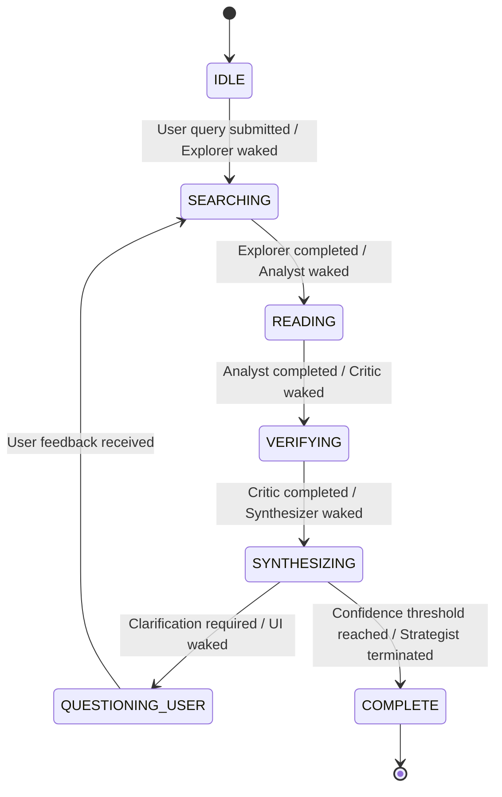

# ResearchMind Swarm v1 - System Architecture

This document specifies the event-driven swarm architecture of the Research Intelligence Platform.

---

## 1. Core Architectural Pillars

The platform is designed around four main components:
1. **Research Blackboard**: The shared working memory containing:
   - **Working Memory**: Dynamic facts and concept states.
   - **Event Queue**: Buffered messages waiting for processing.
   - **Active Tasks**: Current operational queue.
   - **Session Context**: Research queries, parameters, and constraints.
   - **Session State**: Current configuration and active connections.
2. **Task Scheduler**: A priority queue scheduler that reads events from the Event Queue and schedules agent activations. It abstracts high-level RL actions into executable agent instructions.
3. **Agent Registry**: Registers agent instances, their event subscriptions, and capabilities dynamically.
4. **Stable-Baselines3 PPO Strategist**: The sequential decision engine deciding optimal actions (e.g., `SEARCH_PAPERS`, `ANALYZE_PAPER`, `VERIFY_CLAIM`, `CONNECT_CONCEPTS`, `CLARIFY_USER`, `TERMINATE`).

---

## 2. Research State Machine

To track system execution, a centralized state machine transitions through the following phases:



* **IDLE**: The system is waiting for a research query or document upload.
* **SEARCHING**: The Explorer Agent queries academic APIs (arXiv, Semantic Scholar) and performs citation crawls.
* **READING**: The Analyst Agent parses full text via PyMuPDF/GROBID and extracts structured concepts, methods, equations, and experimental baselines.
* **VERIFYING**: The Critic Agent cross-checks claims, identifies contradictions, evaluates evidence strength, and runs hallucination checks.
* **SYNTHESIZING**: The Synthesizer Agent clusters concepts, aggregates paper connections, and updates the global NetworkX knowledge graph.
* **QUESTIONING_USER**: The UI Agent prompts the user for clarification when the Strategist detects critical contradictions or missing objectives.
* **COMPLETE**: The final research narrative is compiled, exported (LaTeX, Word, Slides, PDF), and the session is archived in PostgreSQL.

---

## 3. Asynchronous Event-Driven Flow

```
[Explorer Agent] ──(NEW_PAPER_FOUND)──> [Event Queue] ──> [Task Scheduler]
                                                                │
                                                         (Map to Analyst)
                                                                │
                                                                ▼
                                                        [Analyst Agent]
```

1. **Event Trigger**: When an agent completes an operation, it writes the result to the Blackboard and publishes an Event.
2. **Buffering**: The Event Bus pushes the event into the Blackboard's Event Queue.
3. **Action Selection**: The RL Strategist observes the Blackboard's state (Resource Budget, Task Queue, Graph Completeness) and recommends an abstract action.
4. **Scheduling**: The Task Scheduler reads the priority queue, pairs the recommended action with the pending event, and wakes up the selected agent from the Agent Registry.
5. **Autosave Checkpointing**: After every state change, the Memory Keeper commits the memory state to PostgreSQL as a snapshot.
