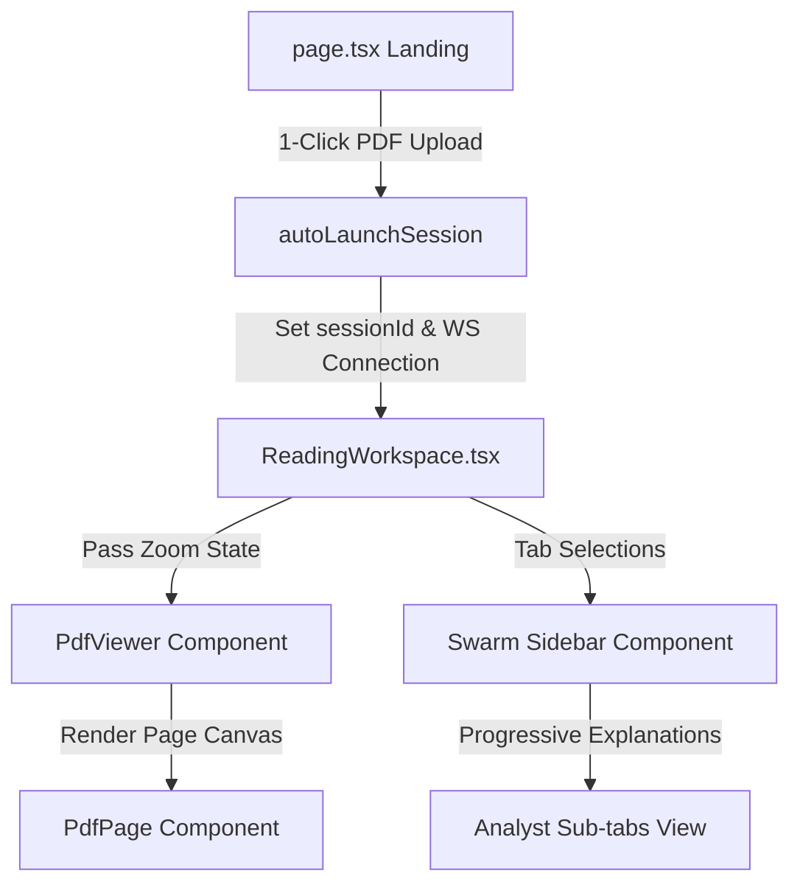

# Research IDE - Frontend Architecture & Design Specification

This document details the frontend implementation, state management, visual styling, and rendering systems of the **Interactive AI Research Reading Workspace (Research IDE)**.

---

## 1. Component Hierarchy & Flow



---

## 2. Rendering System (High-DPI / Crisp Text)

Standard canvas rendering displays blurry text on high-resolution screens (4K / Retina) because it maps canvas coordinate units directly to CSS pixels. To ensure crisp, print-quality readability, we implement **Device Pixel Ratio (DPR) Upscaling**:

1. **Query Device Pixels**: We extract `window.devicePixelRatio`.
2. **Upscale Backing Store**: Multiply the canvas element width and height by the DPR.
3. **Keep CSS Layout Sizing**: Explicitly lock style bounds to the original viewport CSS sizing.
4. **Context Scaling**: Apply a scale transformation `context.scale(dpr, dpr)` to match the coordinate matrix.

```typescript
const dpr = window.devicePixelRatio || 1;
canvas.width = viewport.width * dpr;
canvas.height = viewport.height * dpr;
canvas.style.width = `${viewport.width}px`;
canvas.style.height = `${viewport.height}px`;
context.scale(dpr, dpr);
```

### Transparent Text Selection Layer
Overlaid precisely on top of each page's canvas is an absolute-positioned HTML container containing transparent character segments extracted using `page.getTextContent()`. By projecting the PDF matrix transform onto screen coordinates via `pdfjsLib.Util.transform`, characters align exactly with the visual canvas underneath:

```typescript
const viewport = { transform: [scale, 0, 0, -scale, 0, viewportHeight] };
const tx = pdfjsLib.Util.transform(viewport.transform, item.transform);
// Style targets absolute pixels matching the canvas drawing
```

---

## 3. Dynamic Zoom State
* **Zoom Level**: Tracked as a reactive scale number state `const [zoom, setZoom] = useState(1.3)` inside `ReadingWorkspace.tsx`.
* **Controls**: Header-mounted incremental buttons (`+` / `-`) let users step zoom levels between `75%` and `250%`. Altering this state automatically triggers canvas repainting and text overlay repositioning.

---

## 4. Swarm Analyst Tabs & Activity Monitor
* **Smart Selection Toolbar**: Clicking or dragging cursor highlights on the PDF page brings up a floating menu containing lens options: `Explain`, `Math`, `Critique`, `Code`, `Related`, `Notes`.
* **Sub-Tabs Layout**: The Swarm Analyst tab organizes findings into 6 sub-viewports to avoid long scrolling:
  * `Explain`: Intuition (Lvl 1), Summary (Lvl 2), and Author Choice Intent details.
  * `Math`: Full derivations (Lvl 4) formatted using KaTeX math layout.
  * `Critique`: Assumptions, weaknesses, and critic observations.
  * `Related`: References and bibliography papers (Lvl 7).
  * `Code`: PyTorch code block mappings (Lvl 6).
  * `Notes`: Interactive notepad to save custom notes to the database.
* **Swarm Activity Checklist**: When an analyst request is in progress (`explainingState === true`), a checklist outlines agent progression (Explorer, Analyst, Critic, Synthesizer, Memory Keeper) in real time.

---

## 5. Fixed IDE Layout & Scrolling Mechanics
* **Locked Viewport**: `html`, `body`, and `#___next` are locked to `height: 100%; overflow: hidden;` to disable general browser scrolling.
* **Layout Sizing**: The main panel layout height is set to `calc(100vh - 56px)` (subtracting the fixed header height) to fill the remaining screen space.
* **Flex Panel Widths**: Left Reader is locked to `w-[70%]` and Swarm Sidebar is locked to `w-[30%]`, preventing layout shifting when switching sidebar tabs.
* **Independent Scrolling Viewports**: Both Left and Right panels are set to `overflow-y-auto overflow-x-hidden`. Moving the mouse cursor over one panel scroll container isolates scrolling to that area, without shifting the other panel.
* **Scroll State Preservation**: Sidebar tabs are kept active in the DOM using absolute overlay viewports and CSS classes (`block` vs. `hidden`). This preserves the container nodes, ensuring that switching tabs preserves scroll position.

---

## 6. Chromium Black Design Variables
The color scheme is locked to a dark mode palette matching Chromium UI elements:

```css
:root {
  --background: #121212;      /* Deep charcoal background */
  --foreground: #f1f3f4;      /* High-contrast crisp light text */
  --card: #1e1e1e;            /* Lighter gray surfaces */
  --card-hover: #292a2d;      /* Navigation active color */
  --border: rgba(255, 255, 255, 0.08);
  --primary: #1a73e8;         /* Active Chrome blue accent */
}
```
* **Scrollbar Styling**: Scrollbars are styled as thin `#3c4043` gray tracks that blend seamlessly with the Chromium theme.
